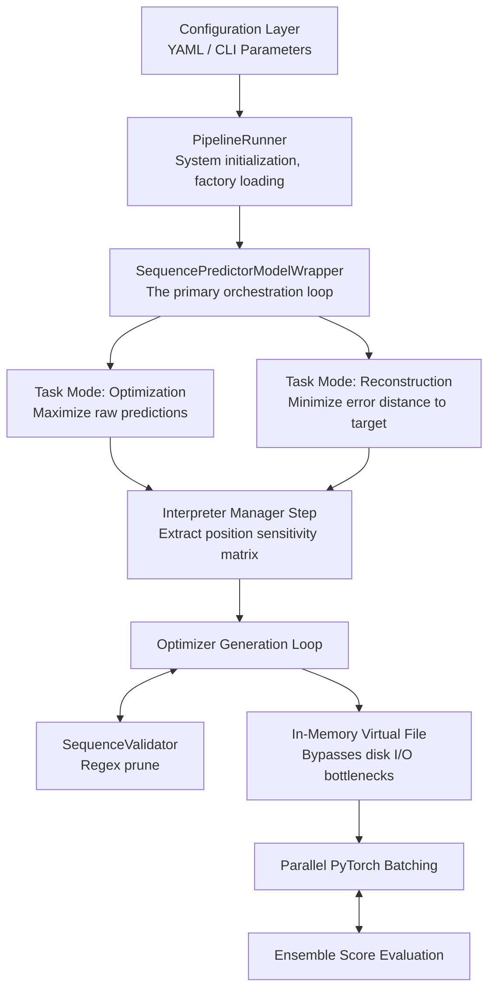

# Pipeline Overview Module

This document defines the computational lifecycle of the universal sequence alignment pipeline. The system passes sequence vectors through optimization iterations to minimize loss or maximize target output scales across an ensemble of black-box simulation environments.

---

## Core Operational Workflow



<!-- ```plaintext
  [Configuration Layer] (YAML / CLI Parameters)
           │
           ▼
   [PipelineRunner] (System initialization, factory loading)
           │
           ▼
[SequencePredictorModelWrapper] (The primary orchestration loop)
           │
     ┌─────┴────────────────────────┐
     ▼                              ▼
 [Task Mode: Optimization]      [Task Mode: Reconstruction]
 (Maximize raw predictions)     (Minimize error distance to target)
     │                              │
     └─────┬────────────────────────┘
           ▼
 [Interpreter Manager Step] (Extract position sensitivity matrix)
           │
           ▼
 [Optimizer Generation Loop] ──► [SequenceValidator] (Regex prune)
           │
           ▼
 [In-Memory Virtual File] (Bypasses disk I/O bottlenecks)
           │
           ▼
 [Parallel PyTorch Batching] ──► [Ensemble Score Evaluation]

``` -->

---

## Detailed Execution Phases

#TODO - napisać 